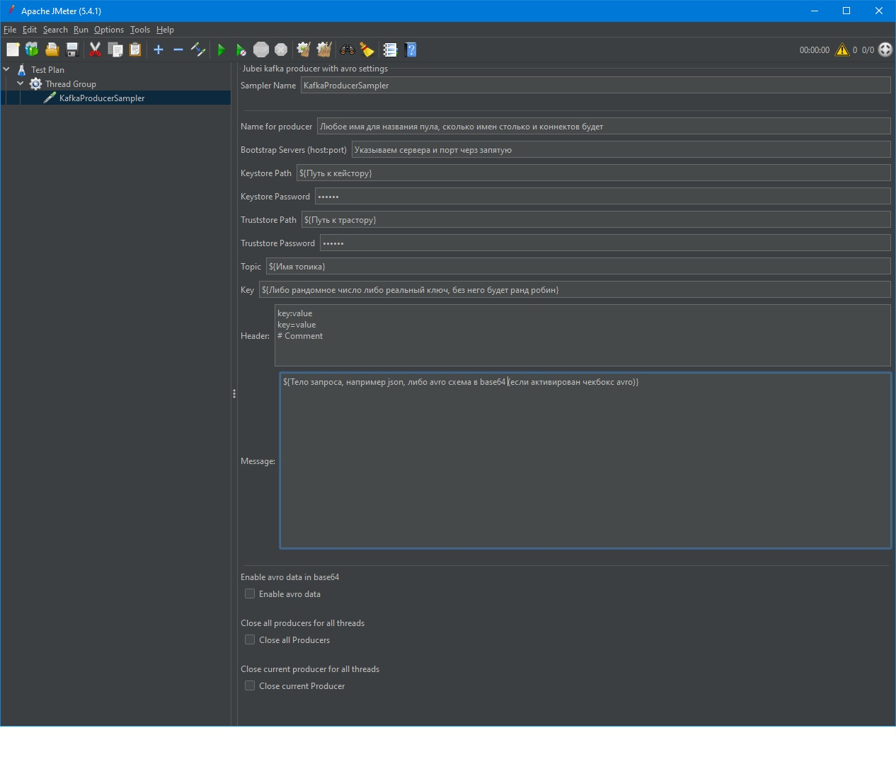

# jubei-jmeter-kafka-sampler
Kafka sampler with connection pooling and Base64-encoded Avro schema support

Плагин является тонким джарником, по этому в jmeter нужно скопировать помимо плагина, kafka библиотеку, 
например kafka-clients-3.6.1.jar https://mvnrepository.com/artifact/org.apache.kafka/kafka-clients/3.6.1

Возможности плагина
1) Можно задавать имя для продюсера и тогда все потоки или группы потоков будут использовать всего один продюсер.
Если имена продюсеров будут различные, то для каждого нового имени будут создаваться новые продюсеры.
2) При выборе Close all Producers закроются все существующие продюсеры, можно использовать в TearDown Thread Goup для завершения теста и закрытия всех продюсеров разом.
3) Можно выборочно убить один из продюсеров если выбрать Close current Producer, для этого нужно указать имя в Name for Producer который нужно удалить и поставить соответствующую галку.
4) Есть возможность по разному комбинировать, если два подряд семплера поставить в скрипт и второй скрипт указать Close current Producer, то каждую итерацию будет создаваться заново продюсер. 
Или если указать рандомное название продюсера, то для каждого треда будет создаваться продюсер, для проверки например разных гипотез.
5) На примере скриншота видно, что можно использоваться в любом поле переменные или делать вставки кода на груви (как и везде, этот плагин не исключение:) ).
7) Без ключа пишется в партиции ранд-робин
8) Добавлена отправка avro в base64 формате.
9) Заголовок можно добавлять как (работает с параметрами как с "=", так и с ":" )
head1=value1
#Comments
head2=value2
head3:value3
10) Распространяется as is. (:
